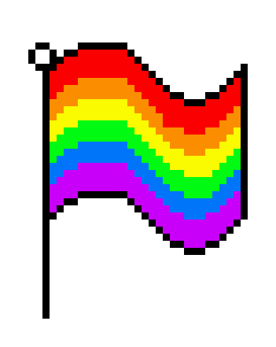
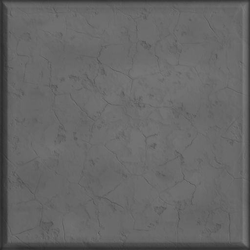

# Logo maze

<!-- TOC -->
* [Logo maze](#logo-maze)
  * [Soundtrack](#soundtrack)
  * [Entity Component System](#entity-component-system)
  * [Texture loading](#texture-loading)
    * [Texture Shader](#texture-shader)
  * [Shaders](#shaders)
  * [Text generation](#text-generation)
  * [Sprites](#sprites)
    * [Sprite sheet](#sprite-sheet)
  * [Positioning objects](#positioning-objects)
    * [Wall](#wall)
  * [Collision](#collision)
  * [Maze generation](#maze-generation)
<!-- TOC -->

It's a simple 2D maze game created using OpenGL 3 and Python.

The character is controlled by the keyboard:
 - W moves upwards
 - S moves downwards
 - A moves leftwards
 - D moves rightwards

The goal is to capture a flag that is a specific point in the world.



## Soundtrack
The game has a simple soundtrack that is implemented using [PyGame Mixer Music](https://www.pygame.org/docs/ref/music.html).

The songs are in the [game/songs](./game/songs) directory.

Current available songs used in the game:
- Lost Woods from Zelda


## Entity Component System

[esper](https://github.com/benmoran56/esper) is used as an Entity Component System (ECS) due to be lightweight with a focus on performance.
ECS is commonly used in games facilitating the code reusability by separating the data from the behaviour. 
Following a composition approach over the inheritance, solving the diamond problem that may happen in deep inheritance hierarchy.
Due to the isolated components, the unit test becomes more simple.

Components describe the attributes that one Entity can have. 

Systems are created to implement the behaviour such as physics, the rendering pipeline.

Advantages of using ECS:
- More flexibility to define objects using reusable parts.
- Separates data from the functions that uses it.
- Has a clean design with decoupling, modularization, reusable methods.

Source: https://www.guru99.com/entity-component-system.html


Source: https://medium.com/@clevyr/entity-component-system-for-react-js-e3ab6e9be776

The ECS components implemented are in the [game/ecs](./game/ecs) folder.

## Texture loading

The created [Texture](./game/gfx/texture.py) class abstracts texture loading from OpenGL.
It supports image flipping after loading, for the use cases where the image is not in the correct position.
For image loading, the [Pillow](https://pillow.readthedocs.io/en/stable/) package is used.

```python
from PIL import Image, ImageOps
from OpenGL.GL import *

with Image.open(file_path) as image:
    if flip:
        image = image.rotate(180)
        image = ImageOps.mirror(image)

    pixels = image.tobytes()

    self.handle = glGenTextures(1)
    glBindTexture(GL_TEXTURE_2D, self.handle)

    glTexParameteri(GL_TEXTURE_2D, GL_TEXTURE_MIN_FILTER, GL_NEAREST)
    glTexParameteri(GL_TEXTURE_2D, GL_TEXTURE_MAG_FILTER, GL_NEAREST)
    glTexParameteri(GL_TEXTURE_2D, GL_TEXTURE_WRAP_S, GL_REPEAT)
    glTexParameteri(GL_TEXTURE_2D, GL_TEXTURE_WRAP_T, GL_REPEAT)

    glTexImage2D(GL_TEXTURE_2D, 0, GL_RGBA8, image.width, image.height, 0, GL_RGBA, GL_UNSIGNED_BYTE, pixels)
```

The current implementation load the textures with GL_REPEAT mode.

### Texture Shader

In order to render a given texture, two simple shaders was used. 
A [vertex shader](resources/shaders/texture_vs.glsl) to position the objects in the world with a UV mapping.
A [fragment Shader](resources/shaders/texture_vs.glsl) to map the texture to the object using UV mapping.

```glsl
#version 330

uniform sampler2D tex;

in vec2 v_uv;

out vec4 FragColor;

void main() {
    FragColor = texture(tex, v_uv);
}
```

Example of UV mapping but for 3D objects.


Source: https://en.wikipedia.org/wiki/UV_mapping


Source: http://www.opengl-tutorial.org/beginners-tutorials/tutorial-5-a-textured-cube/

A quad was used to represent the objects in the world and to apply texture to them.

## Shaders

The shader compilation and linkage process was abstracted by the [Shader](./game/gfx/shader.py) class implementation.
The current implementation loads the two expected Vertex and Fragment shaders, compiling and linking them into a new program.
If the shaders failed to compile or the link phase, a custom exception is thrown with an error message.

```python
def compile_shader(file_path, shader_type):
    with io.open(file_path) as file:
        shader_source = file.read()

        handle = glCreateShader(shader_type)
        glShaderSource(handle, shader_source)
        glCompileShader(handle)

        # check for shader compile errors
        success = glGetShaderiv(handle, GL_COMPILE_STATUS)

        if not success:
            info_log = glGetShaderInfoLog(handle)

            raise ShaderCompilationException(
                f"Shader compilation failed for file '{file_path}': " + info_log
            )

        return handle
```

## Rendering

## Text generation

Some texts were generated using [TextCraft](https://textcraft.net/) and imported as texture in OpenGL.
They are located in the [game/textures/text](./game/textures/text) directory.


This approach is more simple but less flexible compared to text to image generation that can be implemented using [HarfBuzz](https://github.com/harfbuzz/harfbuzz), for example.
However, it would be more complex and would take more time to implement.


## Sprites

A simple system composed of a Sprite component and an [AnimationProcessor](./game/ecs/processor/render.py) was implemented for the walking animation of the character.
It's composed of a set of directions and images that are sequentially changed to create the animation.
The [WalkAnimation](./game/ecs/component/render.py) component store the direction mapping to the sprites.

```python
for direction, path in animations.items():
    textures = map(lambda f: os.path.join(path, f), os.listdir(path))
    textures = filter(os.path.isfile, textures)
    textures = list(map(lambda f: Texture(f, flip), textures))

    self.animations[direction] = itertools.cycle(textures)

```

The [AnimationProcessor](./game/ecs/processor/render.py) change the current texture of the object according to the direction the object is moving towards.

```python
for ent, (render, animation, velocity) in self.world.get_components(Renderable, WalkAnimation, Velocity):
    if not velocity.is_moving():
        continue

    render: Renderable = render

    direction = velocity.directions()[0]

    animation: WalkAnimation = animation
    animations = animation.animations.get(direction)

    if animations is not None:
        render.texture = next(animations)
```

### Sprite sheet

The Yoshi sprite sheet used was created by [A.J Nitro](https://www.spriters-resource.com/game_boy_advance/mlss/sheet/7565/).


The sprites are divided into 4 directories according to the direction.
They are in the [game/textures/yoshi](./game/textures/yoshi) directory.


## Positioning objects

A vertex shader is used by all objects to position them into the world.
The current implementation receives a vertex, a UV point and the transformations as an uniform and apply them to the vertex.
The transformations are created using the glm library. They are combined 

```glsl
#version 330

layout (location = 0) in vec3 vertex;
layout (location = 1) in vec2 uv;

uniform mat4 transformations;

out vec2 v_uv;

void main() {
    gl_Position = transformations * vec4(vertex, 1.0);
    v_uv = uv;
}
```

### Wall

The wall is positioned according to the maze generated. 
The position is set and the vertex shader apply the transformations to correctly position the wall in the world.



> The texture used for the wall was extracted from [Umsoea](https://minecrafthub.com/texture/umsoea-pack-1-17-1-1-16-5-no-lag-free) texture.


## Collision

A simple collision system is implemented to prevent the player from passing through the walls in the game.

## Maze generation

To generate a Maze dynamically the [mazelib](https://github.com/john-science/mazelib) implementation was used.
The world has an adjustable size that increases the maze size and consequentially, the difficulty of the game.
There algorithms available to use are described in [mazelib documentation](https://github.com/john-science/mazelib/blob/main/docs/MAZE_GEN_ALGOS.md).


Source: https://github.com/john-science/mazelib/blob/main/docs/MAZE_GEN_ALGOS.md

The monte carlo approach is used to generate the final maze with at least one solution.
The solution start point and endpoint are used to position the player and the flag that the player should capture.
